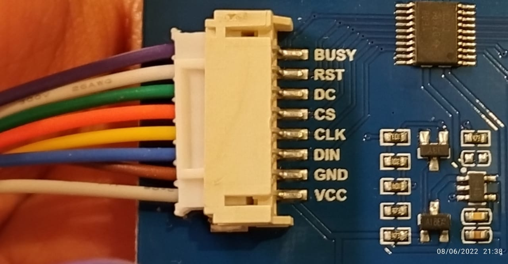
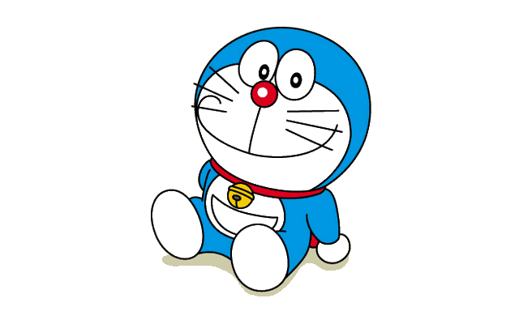
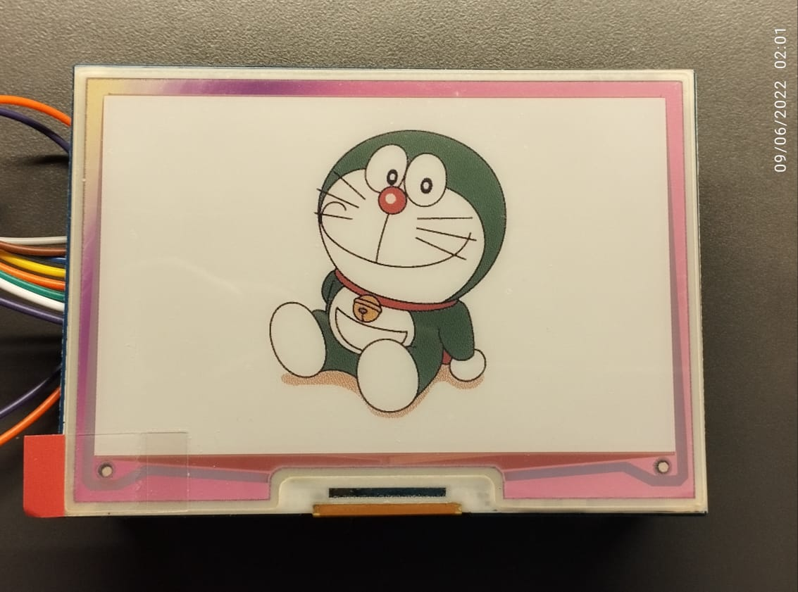

# Using the WaveShare 7 Colour e-Paper/e-ink Displays
I recently bought a [Waveshare 7 colour e-paper display](https://www.waveshare.com/5.65inch-e-paper-module-f.htm) to experiment with. This is the same technology used in some of the Amazon Kindles(the ones without a backlight). [Something like this](https://www.amazon.ca/All-new-Kindle-Paperwhite-Waterproof-Storage/dp/B075RMST1M/ref=sr_1_5?keywords=kindle&qid=1654579145&sr=8-5). Some interesting things about this display include:
* The ability to display 7 colours, which is pretty rare in e-paper/e-ink displays
* It needs no power to retain its image and can do so indefinitely
* Passively reflective(again, no backlight), so great visibility in sunlight

This document is intended to be a guide for new users who are interested in using this display, as the documentation and code available from WaveShare is subpar and very poorly explained.

**Beware that this display takes ~30 seconds to fully refresh. WaveShare has also not attempted to explain nor demonstrate partial refresh for this display.**

## Prerequisite Knowledge & Setup
The parts you will need are:
* An Arduino/other micro-controller with 5-6 wires
* The WaveShare 7 colour e-ink display **WITH THE PCB**. Please make sure that the module you buy does **NOT** have just a ribbon connector. It should have a plastic connector that looks like this:



To get the most out of this guide, make sure you are familiar with:
* The Arduino ecosystem (have basic experience with Arduino, and be familiar with programming it in the Arduino language) 
 >Note: This guide should also work with other micro-controllers in the Arduino language circle, such as ESP32s and ESP8266s. However, you might have to adjust some SPI parameters, so be sure to read up on how Arduino configures the SPI bus by default.
* Some basic familiarity with SPI. If you need a refresher, SparkFun has an excellent guide [here](https://learn.sparkfun.com/tutorials/serial-peripheral-interface-spi/all).

The documentation relevant to get started at the time of writing includes:

* [This wiki](https://www.waveshare.com/wiki/5.65inch_e-Paper_Module_(F))
* [Controller (SPD1656) documentation](https://www.waveshare.com/w/upload/b/bf/SPD1656_1.1.pdf)
* [Reference Design Notes](https://www.waveshare.com/w/upload/b/b5/5.65inch_e-Paper_%EF%BC%88F%EF%BC%89_Application_Note_Reference_Design.pdf)
* [Their Demo Code (which did not work for me, but nevertheless provided some insight into operation)](https://www.waveshare.com/wiki/5.65inch_e-Paper_Module_(F)#Demo_code)

## Theory of Operation
The way the controller works (and SPI in general) is that we write certain commands to the registers in the controller, which trigger changes in the operation of the e-paper display(for example triggering a reset or displaying an image). Which register to write to for making a change is explained in the command table(pg17 of the SPD1656 documentation). More explanation of each register and how it can be configured is explained in the pages following the command table(Command Description). The value of **command** is the register that we write to and the value of **data** is the data written to the register. Some registers may require more than one byte of data.

How does the controller know whether you are sending a **command** or **data**? Via the DC pin. If the DC pin is low, the controller knows you are sending a **command**. When it is high, you are sending **data** to a register. 

The busy pin is used to indicate that the controller is busy, and thus you should not send any data or commands. It is **active low**, which means the controller is busy when the busy pin is low, and available when it is high.

The reset pin is used to trigger a hardware reset of the e-paper display controller. 

Reading through their demo code, the Reference Design Notes(pg 8), and the SPD1656 documentation(pg 37) we can find an application workflow which explains how to draw an image on the screen. You might notice that the workflows are slightly different, which is unfortunate. However, the one we follow in this guide(closely related to the one in SPD1656 doc) got my display working, and it should get yours too.

### Image Transmission
According to the online wiki, the way an image is transmitted is that 1 byte holds 2 pixels(of 4 bits each). To hold 7 colours, you only need 3 bits as 0d6 = 0b110, if the first colour is 0d0. However, they pad these bits with another 0 to make it 4 bits. 
So the bits corresponding to each colour are:
| Half-Byte | Colour|
| ----------- | ----------- |
|0x0|Black|
|0x1|White|
|0x2|Green|
|0x3|Blue|
|0x4|Red|
|0x5|Yellow|
|0x6|Orange|

There is another colour, which you can access with 0x7, but it is not mentioned officially. It kind of resembles the colour of coffee...

If you wanted the first two pixels to be blue and green, you would transmit 0x32. Transmitting 0x05 next would result in the next 2 pixels being black and yellow. So you would have 4 pixels: blue, green, black, and yellow, in that order.


## Workflow
Here is the initialization workflow we will follow:
#### 1. Power on sequence/hardware reset (pg 36 of SPD1656 doc)
According to the text under diagram 9.1, we need to wait 10ms after VDD is stable(basically when Arduino is turned on), and keep reset pin low for atleast 100μs, and then high. Once reset is high, we need to wait for busy pin to be high. After that, we can send initialization commands to the controller. 
#### 2. PSR Register (0x00)
Looking at the Command description for this register(pg 21, SPD1656 doc), we see it accepts 2 bytes as data. Its bits are named A~0~ to A~7~ and B~0~ to B~7~.
> **How to read the description**
> In the left columns, we can see the "D/C#" column, which tells us if this is a **command** or **data**. If it is 0, we know it's a **command**. If it is 1, it is **data**. What bits will configure what is described in the right most column titled "Description"

Bits A~7~ to A~5~ select the resolution of our display. In my case, this is 640x400, which is not available in the table. However, there is an alternate register for resolution we will use later. So for now, I will stick with 640x480, so A~5~=1, A~6~=0, A~7~=0. If you want to go with 640x320 for example, A~5~=0, A~7~=1, A~6~=0.  A~4~ is reserved, so we can keep it 0. A~3~ is kept 1. The default is 0, but that flips and inverts the image for me. A~2~, A~1~, and A~0~ are left to their default value of 1. So the value that we would transmit is **0010_1111** or **0x2F**.

For byte B, we will leave everything default. Feel free to edit parameters and mess around. We can only configure B~7~, B~2~, B~1~, and B~0~, which are left to their default values. The value transmitted is therefore **0x00**.

#### 3. PWR register (0x01)

Accepts 5 bytes, but we will send only 4 (all values are mentioned in the demo code)
* Byte A: 0x37 
* Byte B: 0x00
* Byte C: 0x05
* Byte D: 0x05

#### 4. PFS register (0x03)
Accepts 2 bytes, but only send 1. Also mentioned in demo code:
* Byte A: 0x00

#### 5. BTST register (0x06)
Send 3 bytes:
* 0xC7
* 0xC7
* 0x1D
#### 6. TSE register (0x41)
Send 1 byte:
* 0x00
#### 7. CDI register (0x50)
Send 1 byte:
* 0x37
#### 8. TCON register (0x60)
Send 1 byte:
* 0x22
#### 9. TRES register (0x61)
This is the alternate resolution register mentioned in the PSR register description in this guide.
Since my horizontal resolution is 640 (0b10_1000_0000), and vertical resolution is 400(0b01_1001_0000), I will send 0x02, 0x80, 0x01, and 0x90 respectively.

#### 10. PWS register (0xE3)
Will send 1 byte:
* 0xAA

***
**At this point, all initialization of the display is complete, and we are ready to transmit an image. This also means you only need to do the above steps once if you want to render multiple images on your screen. The below steps must be performed each time you want to display something.**
***
#### 11. Repeat Step 9(TRES register)
This step is repeated every time something is to be displayed on the screen in the demo code provided by WaveShare.

#### 12. DTM1 register. (0x10)
This is the register that will hold the image data. Once you transmit 0x10 with the d/c pin low, you send the number of bytes needed for all the pixels. In my case, that would be (640x400)/2=1,28,000 bytes (since 1 byte holds information for 2 pixels)
For example, to colour the entire screen black, some pseudocode could be:

```
pinMode(dcPin, LOW);
spiTransmit(0x10);
pinMode(dcPin, HIGH);
for(long i = 0; i<128000; i++){
	spiTransmit(0x11);
}
```

#### 13. PON Register (0x04)
This register turns on the internal mechanism in the screen in order to refresh. It does not need any data sent. However, you **must** wait for busy pin to become **high** before proceeding.

#### 14. DRF Register (0x12)
This registers triggers the screen to update from it's internal memory (the data sent to register 0x10). It does not need any data sent. But you **must** wait until busy pin becomes **high** before proceeding. 
> Note: this process takes a long time (~30 seconds) and results in the screen flashing multiple times.

#### 15. POF Register (0x02)
This register switches off the internal mechanism needed for refreshing the display. No data is needed, but you **must** wait until busy pin has become **low** before proceeding.

**These are all the steps required to display an image on the screen**

## Preparing an image to be displayed
Since the display can only show 1 of 7 colours per pixel, it is not possible for us to take an RGB image and send it's pixel data directly to the screen. We will make use of the [Floyd-Steinberg algorithm](https://en.wikipedia.org/wiki/Floyd%E2%80%93Steinberg_dithering) as described by WaveShare [here](https://www.waveshare.com/wiki/E-Paper_Floyd-Steinberg). Their instructions require an Adobe Illustrator/Photoshop subscription, and please feel free to follow them if you can. Just make sure you end up with an image that has a resolution equivalent of your screen and is dithered(consisting of only the 7 colours our screen can display) and skip the instructions below.

However, **if you do not have an access to those programs**, you can follow the instructions below. Otherwise, skip to the next section.

1. Crop and resize your image to the resolution of your e-paper display.
2. Go to [https://ditherit.com/](https://ditherit.com/) and select/drop your cropped image.
3. Click on the import button in the palette box and enter the following text in the box and click "Import". These are colours that our screen can display
```
[{"hex":"#000000"},{"hex":"#0000ff"},{"hex":"#ff0000"},{"hex":"#00ff00"},{"hex":"#ff8000"},{"hex":"#ffff00"},{"hex":"#ffffff"}]
```
4. Leave the advanced options as they are or feel free to try some options other than Floyd-Steinberg. **Selecting 'Serpentine Dither' created extra colours other than the palette we provided which created problems further along. So make sure not to select it**.
5. Click on "Dither" and download the converted PNG image with the "Save" button.

At this point, we have to go through each pixel, and map it to a number according to the table given above under "Image Transmission", while combining the two pixels together into 1 byte. This is easily doable with a Python program. Skip the next section if you do not have an Adobe subscription.


### If you had an Adobe subscription
At this point, you will have a dithered GIF image, which we will convert to an array using a Python program. 
We have to go through each pixel, and map it to a number according to the table given above under "Image Transmission", while combining the two pixels together. This is easily doable with a Python program. The way that the Program reads the GIF pixels is not as an RGBA tuple, but by an index defined by the colour table(this mode of an image is called Palette mode). This index does not correspond to the colour index provided by WaveShare (under "Image Transmission"). So we will use a Python script to convert our image from Palette mode to RGBA mode and then combine two pixels to form a byte.


### The Python Script

*imgToArray.py* is a script that converts an image into RGBA mode (if it already isn't), and reads in 2 pixels at a time, and prepares a file called *imagedata.cpp* which has 4 equally sized arrays containing all the image data. **Make sure to change the name of the selected image file to the image you want to convert inside the script**. Skip the next part to continue the Arduino setup.
>Note: This Python script requires the PIL(Python Imaging Library) module to work. To install it, run `pip install pillow` in your command line

## Hardware Setup
Here is how the following pins from the display are connected to my Arduino:
* Reset -> pin 8
* DC -> pin 9
* CS -> pin 10
* Busy -> pin 7

All of the pins mentioned above can technically be connected to any other GPIO pin available. (They won't need PWM)
The pins mentioned below are SPI pins and have **specific** connections depending on your Arduino model. The screen won't work if they are connected to other pins.

For Arduino Mega (which I am using):
* CLK -> pin 52
* DIN -> pin 51 (MOSI/COPI)

We don't need a MISO/CIPO connection as the screen does not send any data to the Arduino. 

**The Arduino Uno by itself is insufficient** as it does not have enough memory to hold all of our image data (128,000 bytes). Nevertheless, if you are storing it externally(for eg. on an SD card), here are pin mappings for CLK and DIN:
* CLK -> pin 13
* DIN -> pin 11 (MOSI/COPI)

## Arduino Code
My arduino code is set up in the following manner:
#### SPI Config and Functions
I use the standard SPI library with the following configurations:
* Clock speed: 20 Mhz
* Data Order: MSB First
* Mode: 0

This configuration is done with the following line of code after SPI.begin()
```
SPI.beginTransaction(SPISettings(2000000, MSBFIRST, SPI_MODE0));
```
I have defined two functions called `SendCommand` and `SendData` which configure the DC and CS pins before using the standard `SPI.transfer` to transmit information over the MOSI/COPI line.
#### Other functions
There are two functions called `BusyHigh` and `BusyLow` which wait for the busy line to become High or Low respectively.

There is another function called `Reset` which initiates a hardware reset(1^st^ step of the workflow).

Another function called `EPDInit` initializes the pins, configures SPI, executes steps 1 to 10 of the workflow, and clears the screen(writes white pixels to the entire screen).

The function `createFarPointers` is explained in the blockquote below.
#### Image Array Storage and File Management
There are 3 files in the entire Arduino side of the project(apart from the two Python scripts which create imagedata.cpp):
* **epaperTest.ino**
This is the main file containing the setup and loop blocks.
* **imagedata.h**
This is a header file that has 4 external constant arrays. The `extern` keyword means that this variable is defined somewhere else.
* **imagedata.cpp**
This file holds the actual image data which is transmitted to the controller in the form of 4 equally sized byte arrays. The compiler that the Arduino environment uses can only have a maximum of 32KB(32,767 B) per array. Since I have 128,000 bytes, it made sense to use 4 arrays of 32,000 B.
>The `#define PROGMEM_LATE __attribute__ (( __section__(".fini1") ))` declaration is made to instruct Arduino linker script to place this data in fini1 section rather than where the code is stored. You can find more about this [here](https://forum.arduino.cc/t/maximum-progmem-data-size-arduino-mega/373448/11). We use the defined keyword `PROGMEM_LATE` before each array as they are too big to be kept in the text section.
>We then have to use `pgm_get_far_address` and `pgm_read_byte_far` as we are using 32 bit pointers, instead of 16 bits. [`pgm_get_far_address`](https://www.nongnu.org/avr-libc/user-manual/group__avr__pgmspace.html#ga8ddf0e398bde8078aa9395ac77c83f0a) gets the 32-bit pointer to the "far" data(as the arrays are placed in a later section) and [`pgm_read_byte_far`](https://www.nongnu.org/avr-libc/user-manual/group__avr__pgmspace.html#ga0d4d7f6231716747c52b969d4febdeed) gets 1 byte from the provided 32 bit pointer.

## My Sample Code
If you upload the sample code that I have provided, your screen will clear itself, and display an image of Doraemon, a character from a show of the same name that I used to watch as a child.

Here are the steps to run my sample code:
1. The original file that I want to display is called `doraemon.png`. The dithered version of this image is called `ditherDoraemon.png`. Open command line, and type `python imageToArray.py`. This command will convert the image to our pixel data and save it to `imagedata.cpp`. 


2. Open `epaperTest.ino` in Arduino and upload the program. The program takes quite a while to upload due to the large size of the image data. Open the serial monitor for debugging messages.
> Note: You will have to close Arduino while rewriting `imagedata.cpp` with the Python script. Arduino gave me errors if I did not restart it or close and reopen `imagedata.cpp` in Arduino after rewriting it.
3. You will see the screen flash and clear itself to all white. Once that happens, it will start flashing again, and we will be able to see Doraemon appear. Take a look at the Serial monitor to get a sense of when everything happens.

Here is the final result:

